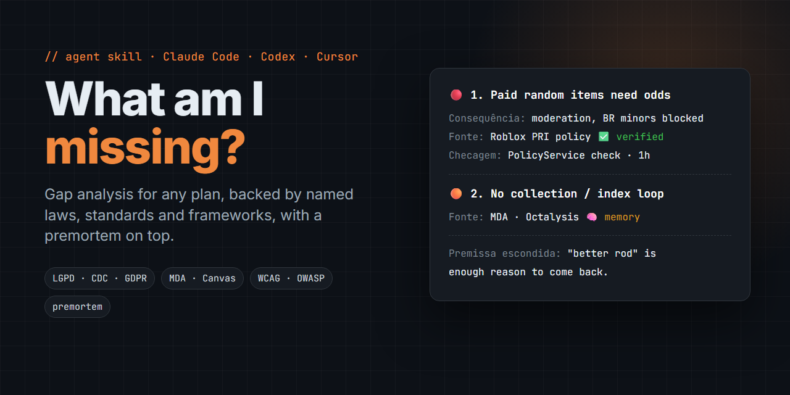

# What Am I Missing? A gap-analysis skill for Claude Code and AI agents



**`what-am-i-missing`** is an open-source [Agent Skill](https://agentskills.io) for **Claude Code**, Claude Desktop, Codex, Cursor and other AI coding agents. It finds what your plan, brief, game design doc, launch checklist or business idea leaves out. Every gap it reports is tied to a **named law, standard, framework or market benchmark**, so you can trace each finding back to its source.

Ask *"what am I missing?"* (or in Portuguese, *"o que estou esquecendo?"*) and you get **3–7 ranked findings**. Each finding states its consequence, its source, whether that source was checked on the web this session (✅) or recalled from memory (🧠), and the **cheapest next check**. A **premortem** pass then surfaces the hidden assumption that could sink the plan.

> Gap analysis · blind spots · premortem · compliance checklist · industry standards · best practices · LGPD · GDPR · CDC · WCAG · OWASP · MDA · Business Model Canvas

---

## Why use it

A plain "review my plan" prompt gives you a generic list of 30 tips with no sources. That list often repeats what you already have and states law numbers from memory. This skill works differently:

| Plain prompt | `what-am-i-missing` |
|---|---|
| Generic best practices | Gaps checked against **3–6 named references** (laws, ISO/WCAG/OWASP, MDA, Canvas, competitors) |
| Cites "the literature" vaguely | Names the actual source and marks it ✅ **verified** or 🧠 **from memory** |
| May invent regulation numbers | **Verifies law, norm and platform-policy claims with web search** before stating them |
| 20–30 unranked items | **3–7 findings** ranked 🔴 blocker, 🟠 high or 🟢 nice-to-have |
| "Consider testing X" | **Cheapest concrete check**, with time or cost where known |
| Misses recent changes | **Fresh-eyes web scan** for new regulation, platform policy and market shifts |
| Only finds checklist items | **Premortem**: "it's 6 months later and this failed, why?", plus the hidden assumption |
| Repeats what you already track | Reads your docs first. Adds a **"Já coberto"** (already covered) section and a **"Pode ficar pra depois"** (can wait) section with a revisit trigger for each item |

## Install

**Claude Code (plugin marketplace)**
```bash
/plugin marketplace add WednyFernandes/what-am-i-missing
/plugin install what-am-i-missing@what-am-i-missing
```

**Any agent (Claude Code, Codex, Cursor, OpenCode…) via [skills CLI](https://github.com/vercel-labs/skills)**
```bash
npx skills add WednyFernandes/what-am-i-missing
```

**Manual**: copy [`skills/what-am-i-missing/SKILL.md`](skills/what-am-i-missing/SKILL.md) to `~/.claude/skills/what-am-i-missing/SKILL.md`.

## Usage

The skill triggers on its own when you ask things like:

- "What am I missing in this plan?"
- "Find the blind spots / gaps in my launch checklist"
- "What am I forgetting, according to the literature and industry standards?"
- "O que estou esquecendo de citar, segundo a literatura e os padrões do mercado?"
- "Quais os furos desse GDD?"

It answers in the language you use.

## Two modes: global or focused

| You ask… | Mode | What it does |
|---|---|---|
| "What am I missing in this project?" (inside a repo or with a whole plan) | **Global** | Maps the project (README, ROADMAP, docs, manifests), sweeps every area (product, legal, security, accessibility, ops, monetization, marketing, metrics), adds a coverage table (✅ ok / ⚠️ gaps / ⬜ not reviewed), and gives 3–7 findings |
| "What's missing in my privacy policy under LGPD?" / `foco: segurança` | **Focused** | Uses only references for that topic and goes deeper (articles, clauses), reads only the relevant files, gives 3–10 findings, plus at most 2 🔴 "out of focus" items it noticed |

If the request is ambiguous, it runs global mode and offers a focused run at the end.

## Output format

1. **Leitura** (how the skill reads your plan): the plan, its audience, what success means, and the assumptions made
2. **Referências usadas** (references used): 3–6 named frameworks, laws or benchmarks
3. **Já coberto** (already covered): what you already have, plus a coverage-by-area table in global mode
4. **Achados** (findings): 3–7 in global mode or 3–10 in focused mode, each with severity, a plain-terms explanation, the consequence, the source with ✅/🧠 confidence, and the cheapest check
5. **Premissa escondida** (hidden assumption): the load-bearing assumption, plus an early-warning signal
6. **Pode ficar pra depois** (can wait): low-priority items, each with the trigger for revisiting it
7. **Comece por** (start with): the first 3 actions, by impact ÷ effort
8. **Fontes** (sources): links for every verified claim

See a full sample report: [Roblox fishing simulator GDD](examples/roblox-fishing-simulator.md).

## Built-in reference sets

| Domain | References |
|---|---|
| E-commerce (Brazil) | CDC, Decreto 7.962/2013, LGPD, ANVISA/MAPA/INMETRO, NF-e, CONAR |
| Games (Roblox) | MDA, Octalysis/Bartle, Roblox Community Standards & paid-random-item policy, genre benchmarks, D1/D7 retention |
| SaaS / apps | Lean Canvas, AARRR, OWASP Top 10, WCAG 2.2, LGPD/GDPR, app-store guidelines |
| Landing pages / marketing | AIDA/PAS, Cialdini, Core Web Vitals, CONAR/FTC disclosure |
| Business plans | Business Model Canvas, Porter's Five Forces, unit economics (CAC/LTV), tax regime |

The skill isn't limited to these domains. For any other domain it picks the right references itself.

## FAQ

**Is this a replacement for a lawyer or accountant?**
No. It is a scout. Legal and tax findings are verified against public sources when possible, but the "cheapest check" often is "ask a professional".

**How is it different from a premortem skill?**
A premortem imagines failure. This skill also runs a **checklist sweep against named standards and laws**, and labels each source by confidence. The premortem is one step inside it.

**How is it different from [blindspot-audit](https://github.com/MJL-ren/blindspot-audit)?**
blindspot-audit is broader and stateful: it interviews you and keeps a ledger file between runs. `what-am-i-missing` is a single file and stateless, and it centers on **citing named references with verified/memory labels**. Ideas from both blindspot-audit and the [Klein-method premortem](https://github.com/b1rdmania/claude-premortem-skill) are credited below.

**Does it need internet access?**
It works without it. With web search, it verifies regulations and scans for recent changes. Without it, it labels those claims 🧠 "confirmar" (confirm before relying on it).

## Credits

- Premortem method: Gary Klein, *Harvard Business Review* (2007). Skill inspiration: [b1rdmania/claude-premortem-skill](https://github.com/b1rdmania/claude-premortem-skill)
- "Already covered / can wait / cheapest check" structure, inspired by [MJL-ren/blindspot-audit](https://github.com/MJL-ren/blindspot-audit)
- Tested baseline-vs-skill following the [superpowers writing-skills](https://github.com/obra/superpowers) method

## License

[MIT](LICENSE) © Wedny Fernandes
